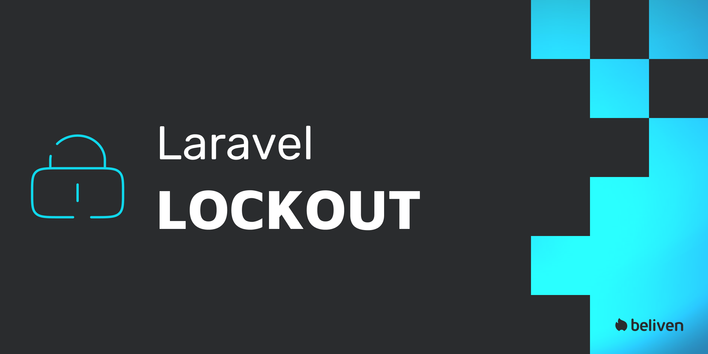

# Laravel Lockout

<p align="center"></p>

[](https://packagist.org/packages/beliven-it/laravel-lockout)
[](https://github.com/beliven-it/laravel-lockout/actions?query=workflow%3Arun-tests+branch%3Amain)
[](https://packagist.org/packages/beliven-it/laravel-lockout)

A small, opinionated Laravel package that locks accounts after repeated failed login attempts. It provides both in-memory throttling (cache counters) and optional persistent locks stored in the database, plus unlock notifications via a temporary signed link.

This README now contains:
- Quick Start (usage)
- Configuration highlights
- API Reference (facade/service)
- Customization examples
- Troubleshooting & testing tips
- Developing (how to run tests, coverage, and contribute)

---

## Quick Start (Usage)

These steps get you from install to a working lockout flow in your app.

1. Install with Composer:

```bash
composer require beliven-it/laravel-lockout
```

2. Publish configuration and migration stubs:

```bash
php artisan vendor:publish --tag="lockout-config"
php artisan vendor:publish --tag="lockout-migrations"
php artisan migrate
```

3. Add the trait to your authentication model (e.g. `App\Models\User`):

```php
use Beliven\Lockout\Traits\HasLockout;

class User extends Authenticatable
{
    use HasLockout;
}
```

4. Protect your login route with the middleware:

```php
use Beliven\Lockout\Http\Middleware\EnsureUserIsNotLocked;

Route::post('/login', [LoginController::class, 'login'])
    ->middleware(EnsureUserIsNotLocked::class);
```

5. Test manually:

- Attempt failing logins for the same identifier until the threshold is reached.
- Inspect the `lockout_logs` table and (if configured) `model_lockouts` for persistent locks.
- If `unlock_via_notification` is enabled, the package will try to send a temporary signed unlock link to a notifiable model.

---

## Configuration (summary)

Full options are in `config/lockout.php`. Here are the most important settings and their defaults:

```php
return [
    'login_field' => 'email',
    'unlock_via_notification' => true,
    'notification_class' => \Beliven\Lockout\Notifications\AccountLocked::class,
    'notification_channels' => ['mail'],
    'max_attempts' => 5,
    'decay_minutes' => 30,
    'cache_store' => 'database',
    'auto_unlock_hours' => 0,
    'unlock_link_minutes' => 1440,
    'prune' => [
        'enabled' => true,
        'lockout_logs_days' => 90,
        'model_lockouts_days' => 365,
    ],
];
```

Recommendation:
- Use a durable cache (Redis or database) in production for counters (`cache_store`) so counters persist across processes and restarts.

---

## Unlock route & controller

The package generates signed unlock links using the route name `lockout.unlock`. 

If you publish the package routes or want to register the route yourself, ensure a route with that name exists and points to the unlock controller:

```php
use Beliven\Lockout\Http\Controllers\UnlockController;

Route::get('/lockout/unlock', UnlockController::class)->name('lockout.unlock');
```

The unlock link is temporary and validates the signature before performing the unlock action. The link lifetime is configurable via the `lockout.unlock_link_minutes` configuration key (default: 1440 minutes, i.e. 24 hours).

---

## API Reference (quick)

Use the `Lockout` facade or the `Beliven\Lockout\Lockout` service from the container.

- `Lockout::getAttempts(string $id): int` — return attempts count for identifier
- `Lockout::incrementAttempts(string $id): void` — increment attempts counter
- `Lockout::hasTooManyAttempts(string $id): bool` — whether attempts >= threshold
- `Lockout::attemptLockout(string $id, object $data): bool` — increment, create log, dispatch EntityLocked when threshold reached; returns whether locked after call
- `Lockout::attemptSendLockoutNotification(string $id, object $data): void` — send the unlock notification if enabled & model is notifiable
- `Lockout::getLoginField(): string`
- `Lockout::getLoginModelClass(): string`
- `Lockout::getLoginModel(string $identifier): ?Model` — tries to resolve a model from configured provider
- `Lockout::lockModel(Model $model, array $options = []): ?ModelLockout` — create persistent lock via relation
- `Lockout::unlockModel(Model $model, array $options = []): ?ModelLockout` — mark lock as unlocked, clear attempts, dispatch EntityUnlocked
- `Lockout::clearAttempts(string $id): void` — clear cached counter

These helpers are also used internally by the `HasLockout` trait; your models can call `$model->lock()` and `$model->unlock()` which delegate to the service.

---

## Customization & Extensibility

- Replace notification class: set `lockout.notification_class` to your own class implementing the same constructor signature (identifier, duration, url).
- Change notification channels: set `lockout.notification_channels` to e.g. `['mail', 'database']`.
- Replace or extend listeners: bind your own listeners for `EntityLocked` / `EntityUnlocked` in your `EventServiceProvider`.
- Replace login model resolver: set `auth.providers.users.model` to change how the package resolves a model for an identifier.

Example: custom notification class in `config/lockout.php`:
```php
'notification_class' => App\Notifications\MyAccountLocked::class,
```

---

## Troubleshooting

- Notifications not sent:
  - Ensure `unlock_via_notification` is `true`.
  - The resolved model must implement `notify()` (use `Notifiable` trait).
  - Verify your mail driver and config (MAIL_* env vars).
- Counters not behaving:
  - Check `cache_store` config; if using `array` store counters reset on each request-run. Use `redis` or `database` in production.
- Signed unlock links failing:
  - Ensure your app URL / APP_KEY is set and consistent.
  - Check the route name `lockout.unlock` and that the route is reachable.
- Coverage / testing:
  - To generate coverage locally you need Xdebug or phpdbg enabled. Example:
    - With Xdebug: `php -d xdebug.mode=coverage vendor/bin/pest --coverage --coverage-text`
    - With phpdbg: `phpdbg -qrr vendor/bin/pest --coverage --coverage-text`
  - On CI use a matrix image with Xdebug enabled.

---

## Developing (run tests, coverage & local development)

If you're working on the package itself locally:

1. Install dev dependencies:
```bash
composer install --dev
```

2. Run tests:
```bash
vendor/bin/pest
```

3. Generate coverage (requires Xdebug or phpdbg):
```bash
# Xdebug
php -d xdebug.mode=coverage vendor/bin/pest --coverage --coverage-text --coverage-clover=coverage.xml

# phpdbg
phpdbg -qrr vendor/bin/pest --coverage --coverage-text --coverage-clover=coverage.xml
```

4. Useful notes:
- Use `config()->set(...)` in tests to override settings (examples in tests).
- Database migrations for tests are in the test bootstrap; if adding schema changes, update migration stubs and test setup.
- To run a single test file with Pest:
```bash
vendor/bin/pest tests/Unit/SomeTest.php
```

---

## Events & Examples

- `EntityLocked` — fired when threshold is reached. Default listener may create a persistent lock and/or send notification.
- `EntityUnlocked` — fired when a persistent lock is cleared. Useful to log unlocks or notify admins.

Example listener registration is done via your `EventServiceProvider` if you need to override defaults.

### Example: Laravel Nova Action

If you use Laravel Nova, you can expose an Action that lets administrators unlock a user directly from the Nova resource. The Action can resolve the model and call the trait helper `$model->unlock(...)`, which delegates to the package service.

Example Nova Action (concise):

```php
<?php

namespace App\Nova\Actions;

use Laravel\Nova\Actions\Action;
use Laravel\Nova\Fields\ActionFields;
use Illuminate\Bus\Queueable;
use Illuminate\Contracts\Queue\ShouldQueue;

class UnlockUser extends Action implements ShouldQueue
{
    use Queueable;

    public function name()
    {
        return 'Unlock account';
    }

    /**
     * Handle the action for the given models.
     *
     * @param  \Laravel\Nova\Fields\ActionFields  $fields
     * @param  \Illuminate\Support\Collection  $models
     */
    public function handle(ActionFields $fields, $models)
    {
        foreach ($models as $model) {
            // call the HasLockout trait helper which delegates to the Lockout service
            // you can pass optional metadata like reason/actor/requestData
            $model->unlock([
                'reason' => 'Unlocked by admin via Nova',
                'actor'  => auth()->user()?->id ?? null,
            ]);
        }

        return Action::message('Selected accounts have been unlocked.');
    }

    public function fields()
    {
        return [];
    }
}
```

Add the action to your Nova Resource (e.g. `User` resource):

```php
// in app/Nova/User.php

public function actions(Request $request)
{
    return [
        new \App\Nova\Actions\UnlockUser,
    ];
}
```

Notes:
- The Nova Action calls the model method `unlock()` directly; the trait delegates to the package service so the unlock behaviour (clearing attempts, dispatching events) remains consistent.
- If you need to customize the service used by the trait, you can override `resolveLockoutService()` on your model (see Customization & Extensibility).

---

## Contributing

Thanks for considering contributions! Please:
- Open issues for bugs/ideas.
- Send PRs with tests and clear motivation.
- Follow coding standards (pint) and run tests before submitting.

---

## License

MIT — see `LICENSE.md` for details.
